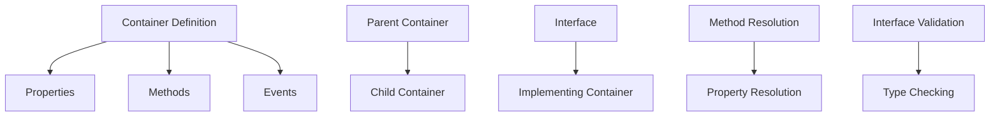

# Inheritance and Interface Implementation in WFL

This document provides a detailed explanation of how inheritance and interfaces will work together in the WFL container implementation.

## 1. Inheritance and Interface Architecture



## 2. Container Inheritance Model

Inheritance in WFL containers follows a single-inheritance model, where a container can extend exactly one parent container:

```wfl
create container Vehicle:
    property make as text
    property model as text
    
    define action describe:
        display make with " " with model
    end action
end container

create container Car extends Vehicle:
    property doors as number defaults to 4
    
    // Override parent method
    define action describe:
        parent describe  // Call parent method
        display "with " with doors with " doors"
    end action
end container
```

In the AST, inheritance is represented by the `extends` field in the `ContainerDefinition` structure:

```rust
ContainerDefinition {
    name: String,
    extends: Option<String>,  // Name of parent container
    // Other fields...
}
```

## 3. Interface Definition and Implementation

Interfaces define a contract that containers must fulfill:

```wfl
create interface Drawable:
    requires action draw
    requires action resize with width and height
end interface

create container Circle implements Drawable:
    property radius as number
    
    define action draw:  // Required by Drawable
        display "Drawing circle with radius " with radius
    end action
    
    define action resize with width and height:  // Required by Drawable
        set radius to minimum of width and height divided by 2
    end action
end container
```

In the AST, interfaces are represented by the `InterfaceDefinition` structure, and interface implementation is represented by the `implements` field in the `ContainerDefinition` structure:

```rust
InterfaceDefinition {
    name: String,
    required_actions: Vec<ActionSignature>,
    line: usize,
    column: usize,
}

ContainerDefinition {
    // Other fields...
    implements: Vec<String>,  // Names of implemented interfaces
}
```

## 4. Method Resolution Order

When a method is called on a container instance, the interpreter follows this resolution order:

1. Look for the method in the container's own methods
2. If not found, look in the parent container (and so on up the inheritance chain)
3. If still not found, check if any implemented interfaces define the method

```rust
fn resolve_method(
    &self,
    container: &ContainerValue,
    method_name: &str,
) -> Option<Rc<FunctionValue>> {
    // Check method cache first
    if let Some((_, method)) = container.method_cache.borrow().get(method_name) {
        return Some(method.clone());
    }
    
    // Check own methods
    if let Some(method) = container.methods.get(method_name) {
        return Some(method.clone());
    }
    
    // Check parent container
    if let Some(parent_weak) = &container.extends {
        if let Some(parent) = parent_weak.upgrade() {
            if let Some(method) = self.resolve_method(&parent, method_name) {
                // Cache the result
                container.method_cache.borrow_mut().insert(
                    method_name.to_string(),
                    (Rc::downgrade(&parent), method.clone())
                );
                return Some(method);
            }
        }
    }
    
    None
}
```

## 5. Property Resolution Order

Similarly, property resolution follows the inheritance chain:

```rust
fn resolve_property(
    &self,
    container: &ContainerValue,
    property_name: &str,
) -> Option<PropertyDefinition> {
    // Check property cache first
    if let Some((_, property)) = container.property_cache.borrow().get(property_name) {
        return Some(property.clone());
    }
    
    // Check own properties
    if let Some(property) = container.properties.get(property_name) {
        return Some(property.clone());
    }
    
    // Check parent container
    if let Some(parent_weak) = &container.extends {
        if let Some(parent) = parent_weak.upgrade() {
            if let Some(property) = self.resolve_property(&parent, property_name) {
                // Cache the result
                container.property_cache.borrow_mut().insert(
                    property_name.to_string(),
                    (Rc::downgrade(&parent), property.clone())
                );
                return Some(property);
            }
        }
    }
    
    None
}
```

## 6. Parent Method Calls

WFL allows child containers to call methods from their parent containers using the `parent` keyword:

```wfl
define action describe:
    parent describe  // Call parent method
    display "with " with doors with " doors"
end action
```

To implement this, we need to handle the `parent` keyword in method calls:

```rust
async fn execute_parent_method_call(
    &self,
    method_name: &str,
    arguments: &[Argument],
    env: Rc<RefCell<Environment>>,
) -> Result<Value, RuntimeError> {
    // Get the current container instance from the environment
    let this_value = match env.borrow().get("this") {
        Some(Value::ContainerInstance(instance)) => Value::ContainerInstance(instance),
        _ => return Err(RuntimeError::new(
            "Cannot call parent method outside of container method".to_string(),
            /* line */,
            /* column */,
        )),
    };
    
    match this_value {
        Value::ContainerInstance(instance) => {
            let instance_ref = instance.borrow();
            
            // Get the container definition
            let container = match instance_ref.container.upgrade() {
                Some(c) => c,
                None => return Err(RuntimeError::new(
                    "Container no longer exists".to_string(),
                    /* line */,
                    /* column */,
                )),
            };
            
            // Get the parent container
            let parent = match &container.extends {
                Some(parent_weak) => match parent_weak.upgrade() {
                    Some(p) => p,
                    None => return Err(RuntimeError::new(
                        "Parent container no longer exists".to_string(),
                        /* line */,
                        /* column */,
                    )),
                },
                None => return Err(RuntimeError::new(
                    "Container has no parent".to_string(),
                    /* line */,
                    /* column */,
                )),
            };
            
            // Look up the method in the parent container
            let method = match parent.methods.get(method_name) {
                Some(m) => m.clone(),
                None => return Err(RuntimeError::new(
                    format!("Method '{}' not found in parent container", method_name),
                    /* line */,
                    /* column */,
                )),
            };
            
            // Evaluate arguments
            let mut arg_values = Vec::new();
            for arg in arguments {
                let value = self.evaluate_expression(&arg.value, Rc::clone(&env)).await?;
                arg_values.push(value);
            }
            
            // Call the method
            self.call_function(&method, arg_values, /* line */, /* column */).await
        },
        _ => Err(RuntimeError::new(
            "Cannot call parent method outside of container method".to_string(),
            /* line */,
            /* column */,
        )),
    }
}
```

## 7. Interface Validation

When a container implements an interface, we need to validate that it provides all the required methods:

```rust
fn validate_interface_implementation(
    &self,
    container: &ContainerValue,
    interface: &InterfaceValue,
) -> Result<(), RuntimeError> {
    for (method_name, signature) in &interface.required_actions {
        // Check if the container has the method
        let method = match self.resolve_method(container, method_name) {
            Some(m) => m,
            None => return Err(RuntimeError::new(
                format!(
                    "Container '{}' does not implement required method '{}' from interface '{}'",
                    container.name, method_name, interface.name
                ),
                /* line */,
                /* column */,
            )),
        };
        
        // Check if the method signature matches
        if method.params.len() != signature.parameters.len() {
            return Err(RuntimeError::new(
                format!(
                    "Method '{}' in container '{}' has wrong number of parameters for interface '{}'",
                    method_name, container.name, interface.name
                ),
                /* line */,
                /* column */,
            ));
        }
        
        // TODO: Check parameter types and return type
    }
    
    Ok(())
}
```

## 8. Multiple Interface Implementation

A container can implement multiple interfaces:

```wfl
create container MultiButton extends UIElement implements Clickable, Draggable, Resizable:
    // Implementation of all required methods from all interfaces
end container
```

When validating interface implementation, we need to check all implemented interfaces:

```rust
async fn execute_container_definition(
    &self,
    name: &str,
    extends: Option<&str>,
    implements: &[String],
    // Other parameters...
) -> Result<Value, RuntimeError> {
    // Create container value
    let container = Rc::new(ContainerValue {
        name: name.to_string(),
        extends: None,  // Will be set later if extends is Some
        implements: Vec::new(),  // Will be populated later
        // Other fields...
    });
    
    // Set parent container if extends is Some
    if let Some(parent_name) = extends {
        let parent_value = match env.borrow().get(parent_name) {
            Some(Value::Container(parent)) => parent,
            _ => return Err(RuntimeError::new(
                format!("Parent container '{}' not found", parent_name),
                /* line */,
                /* column */,
            )),
        };
        
        container.extends = Some(Rc::downgrade(&parent_value));
    }
    
    // Set implemented interfaces
    for interface_name in implements {
        let interface_value = match env.borrow().get(interface_name) {
            Some(Value::Interface(interface)) => interface,
            _ => return Err(RuntimeError::new(
                format!("Interface '{}' not found", interface_name),
                /* line */,
                /* column */,
            )),
        };
        
        container.implements.push(Rc::downgrade(&interface_value));
        
        // Validate interface implementation
        self.validate_interface_implementation(&container, &interface_value)?;
    }
    
    // Register container in environment
    env.borrow_mut().define(name, Value::Container(container));
    
    Ok(Value::Null)
}
```

## 9. Polymorphism

Interfaces enable polymorphism, allowing different container types to be used interchangeably:

```wfl
create list shapes:
    add new Circle with radius 5
    add new Rectangle with width 10 and height 20
end list

for each shape in shapes:
    shape draw  // Works for both Circle and Rectangle
end for
```

To support this, we need to handle method calls on container instances that implement interfaces:

```rust
async fn execute_method_call(
    &self,
    object: &Expression,
    method_name: &str,
    arguments: &[Argument],
    env: Rc<RefCell<Environment>>,
) -> Result<Value, RuntimeError> {
    // Evaluate object expression
    let object_value = self.evaluate_expression(object, Rc::clone(&env)).await?;
    
    match object_value {
        Value::ContainerInstance(instance) => {
            let instance_ref = instance.borrow();
            
            // Get the container definition
            let container = match instance_ref.container.upgrade() {
                Some(c) => c,
                None => return Err(RuntimeError::new(
                    "Container no longer exists".to_string(),
                    /* line */,
                    /* column */,
                )),
            };
            
            // Resolve the method
            let method = match self.resolve_method(&container, method_name) {
                Some(m) => m,
                None => return Err(RuntimeError::new(
                    format!("Method '{}' not found on container '{}'", method_name, container.name),
                    /* line */,
                    /* column */,
                )),
            };
            
            // Evaluate arguments
            let mut arg_values = Vec::new();
            for arg in arguments {
                let value = self.evaluate_expression(&arg.value, Rc::clone(&env)).await?;
                arg_values.push(value);
            }
            
            // Create a new environment for the method
            let method_env = Environment::new(&env);
            
            // Add 'this' to the environment
            method_env.borrow_mut().define("this", Value::ContainerInstance(instance.clone()));
            
            // Call the method
            self.call_function(&method, arg_values, /* line */, /* column */).await
        },
        _ => Err(RuntimeError::new(
            format!("Cannot call method '{}' on non-container value", method_name),
            /* line */,
            /* column */,
        )),
    }
}
```

## 10. Memory Management for Inheritance and Interfaces

To avoid memory leaks and reference cycles in the inheritance and interface system, we'll use several strategies:

### 10.1 Weak References for Parent Containers

```rust
pub struct ContainerValue {
    // Other fields...
    pub extends: Option<Weak<ContainerValue>>, // Weak reference to avoid cycles
    pub implements: Vec<Weak<InterfaceValue>>, // Weak references to avoid cycles
}
```

### 10.2 Method and Property Caching

To improve performance, we'll cache resolved methods and properties:

```rust
pub struct ContainerValue {
    // Other fields...
    pub method_cache: RefCell<HashMap<String, (Weak<ContainerValue>, Rc<FunctionValue>)>>,
    pub property_cache: RefCell<HashMap<String, (Weak<ContainerValue>, PropertyDefinition)>>,
}
```

### 10.3 Cache Invalidation

When a container is modified, we need to invalidate its caches:

```rust
fn invalidate_caches(&self, container: &ContainerValue) {
    container.method_cache.borrow_mut().clear();
    container.property_cache.borrow_mut().clear();
    
    // Also invalidate caches of child containers
    // This would require maintaining a list of weak references to child containers
}
```

## 11. Type Checking for Inheritance and Interfaces

The type checker needs to understand container inheritance and interface implementation:

```rust
fn check_method_call(
    &mut self,
    object_type: &Type,
    method_name: &str,
    arguments: &[Argument],
) -> Result<Type, TypeError> {
    match object_type {
        Type::ContainerInstance(container_name) => {
            // Look up container
            let container = self.lookup_container(container_name)?;
            
            // Look up method
            let method = self.lookup_method(&container, method_name)?;
            
            // Check arguments
            self.check_arguments(&method, arguments)?;
            
            // Return method return type
            Ok(method.return_type)
        },
        Type::Interface(interface_name) => {
            // Look up interface
            let interface = self.lookup_interface(interface_name)?;
            
            // Look up method in interface
            let method = self.lookup_interface_method(&interface, method_name)?;
            
            // Check arguments
            self.check_arguments(&method, arguments)?;
            
            // Return method return type
            Ok(method.return_type)
        },
        _ => Err(TypeError::new(
            format!("Cannot call method '{}' on non-container type {:?}", method_name, object_type),
            /* line */,
            /* column */,
        )),
    }
}
```

## 12. Interface Implementation Challenges and Solutions

### 12.1 Challenge: Method Signature Compatibility

When implementing an interface, the method signatures must be compatible with the interface requirements.

**Solution**: Implement a signature compatibility checker:

```rust
fn check_signature_compatibility(
    &self,
    container_method: &FunctionValue,
    interface_signature: &ActionSignature,
) -> Result<(), RuntimeError> {
    // Check parameter count
    if container_method.params.len() != interface_signature.parameters.len() {
        return Err(RuntimeError::new(
            "Parameter count mismatch".to_string(),
            /* line */,
            /* column */,
        ));
    }
    
    // Check parameter types (if available)
    // Check return type (if available)
    
    Ok(())
}
```

### 12.2 Challenge: Interface Inheritance

Interfaces might inherit from other interfaces:

```wfl
create interface Drawable:
    requires action draw
end interface

create interface AnimatedDrawable extends Drawable:
    requires action animate
    // Inherits 'draw' requirement from Drawable
end interface
```

**Solution**: Implement interface inheritance:

```rust
fn resolve_interface_method(
    &self,
    interface: &InterfaceValue,
    method_name: &str,
) -> Option<ActionSignature> {
    // Check own methods
    if let Some(signature) = interface.required_actions.get(method_name) {
        return Some(signature.clone());
    }
    
    // Check parent interfaces
    for parent_weak in &interface.extends {
        if let Some(parent) = parent_weak.upgrade() {
            if let Some(signature) = self.resolve_interface_method(&parent, method_name) {
                return Some(signature);
            }
        }
    }
    
    None
}
```

### 12.3 Challenge: Diamond Problem

With multiple interface implementation, we might encounter the diamond problem:

```wfl
create interface A:
    requires action foo
end interface

create interface B extends A:
    requires action bar
end interface

create interface C extends A:
    requires action baz
end interface

create container D implements B, C:
    // Must implement foo, bar, and baz
    // But foo is required by both B and C
end container
```

**Solution**: Implement a method resolution order that handles the diamond problem:

```rust
fn validate_multiple_interfaces(
    &self,
    container: &ContainerValue,
    interfaces: &[Weak<InterfaceValue>],
) -> Result<(), RuntimeError> {
    // Collect all required methods from all interfaces
    let mut required_methods = HashMap::new();
    
    for interface_weak in interfaces {
        if let Some(interface) = interface_weak.upgrade() {
            self.collect_required_methods(&interface, &mut required_methods)?;
        }
    }
    
    // Check that container implements all required methods
    for (method_name, signature) in required_methods {
        // Check if container has the method
        let method = match self.resolve_method(container, &method_name) {
            Some(m) => m,
            None => return Err(RuntimeError::new(
                format!("Container '{}' does not implement required method '{}'", container.name, method_name),
                /* line */,
                /* column */,
            )),
        };
        
        // Check signature compatibility
        self.check_signature_compatibility(&method, &signature)?;
    }
    
    Ok(())
}

fn collect_required_methods(
    &self,
    interface: &InterfaceValue,
    required_methods: &mut HashMap<String, ActionSignature>,
) -> Result<(), RuntimeError> {
    // Add own required methods
    for (name, signature) in &interface.required_actions {
        required_methods.insert(name.clone(), signature.clone());
    }
    
    // Add required methods from parent interfaces
    for parent_weak in &interface.extends {
        if let Some(parent) = parent_weak.upgrade() {
            self.collect_required_methods(&parent, required_methods)?;
        }
    }
    
    Ok(())
}
```

## 13. Conclusion

The inheritance and interface system in WFL provides a powerful way to organize code and enable code reuse. By implementing single inheritance for containers and multiple interface implementation, we can support a wide range of object-oriented programming patterns while avoiding the complexities of multiple inheritance.

The memory management strategies, particularly the use of weak references and caching, ensure that the system is efficient and avoids memory leaks. The type checking system ensures that containers correctly implement their interfaces, providing compile-time safety.