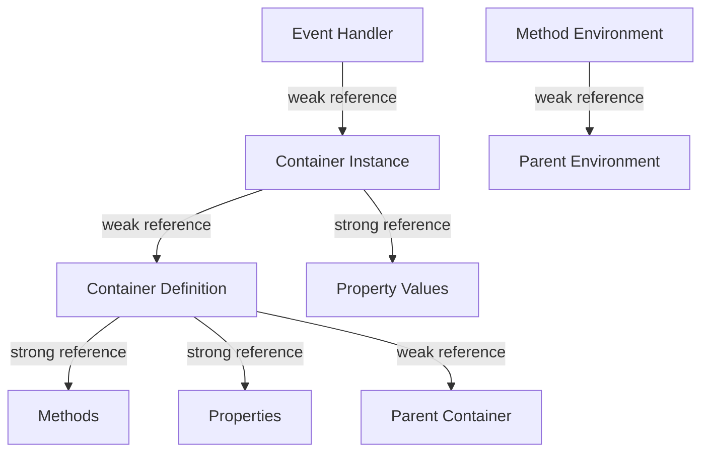

# Memory Optimization Strategies for WFL Container Implementation

This document outlines the memory optimization strategies that will be employed in the WFL container implementation to minimize memory allocations and avoid reference cycles.

## 1. Overview of Memory Challenges

Container systems in programming languages often face several memory-related challenges:

1. **Reference Cycles**: Container instances may reference their container definitions, which in turn may reference parent containers, creating potential reference cycles.
2. **Deep Inheritance Chains**: Resolving properties and methods in deep inheritance chains can be expensive.
3. **Event Handler Leaks**: Event handlers may hold references to container instances, preventing garbage collection.
4. **String Duplication**: Property and method names may be duplicated across many container instances.
5. **Temporary Object Allocations**: Method calls and property access may create many temporary objects.

## 2. Reference Management Architecture



## 3. Weak References for Cycle Prevention

### 3.1 Container Inheritance Cycles

Container definitions will use weak references to their parent containers to prevent reference cycles in the inheritance chain:

```rust
pub struct ContainerValue {
    pub name: String,
    pub extends: Option<Weak<ContainerValue>>, // Weak reference to avoid cycles
    // Other fields...
}
```

This ensures that child containers don't keep their parent containers alive, allowing proper garbage collection of unused containers.

### 3.2 Container Instance to Definition References

Container instances will use weak references to their container definitions:

```rust
pub struct ContainerInstanceValue {
    pub container: Weak<ContainerValue>, // Weak reference to avoid cycles
    pub properties: HashMap<String, Value>,
    // Other fields...
}
```

This allows container definitions to be garbage collected when they're no longer needed, even if instances still exist.

### 3.3 Environment References

Method environments will use weak references to their parent environments:

```rust
pub struct Environment {
    pub values: HashMap<String, Value>,
    pub parent: Option<Weak<RefCell<Environment>>>, // Weak reference to avoid cycles
}
```

This prevents reference cycles between environments and allows proper garbage collection.

### 3.4 Event Handler References

Event handlers will use weak references to their source objects:

```rust
pub struct EventHandler {
    pub source: Weak<RefCell<ContainerInstanceValue>>, // Weak reference to avoid cycles
    pub event_name: String,
    pub handler: Rc<FunctionValue>,
}
```

This prevents event handlers from keeping container instances alive when they're no longer needed.

## 4. Caching Strategies

### 4.1 Method Resolution Caching

To avoid repeated lookups in inheritance chains, we'll cache resolved methods:

```rust
pub struct ContainerValue {
    // Other fields...
    pub method_cache: RefCell<HashMap<String, (Weak<ContainerValue>, Rc<FunctionValue>)>>,
}
```

The cache stores the method and a weak reference to the container where it was found. This improves performance for method calls on containers with deep inheritance chains.

### 4.2 Property Resolution Caching

Similarly, we'll cache resolved properties:

```rust
pub struct ContainerValue {
    // Other fields...
    pub property_cache: RefCell<HashMap<String, (Weak<ContainerValue>, PropertyDefinition)>>,
}
```

This improves performance for property access on containers with deep inheritance chains.

### 4.3 Cache Invalidation

When a container is modified, we need to invalidate its caches:

```rust
fn invalidate_caches(&self, container: &ContainerValue) {
    container.method_cache.borrow_mut().clear();
    container.property_cache.borrow_mut().clear();
    
    // Also invalidate caches of child containers
    // This would require maintaining a list of weak references to child containers
}
```

### 4.4 Lazy Loading

Instead of eagerly loading all properties and methods from parent containers, we'll use lazy loading:

```rust
fn get_property(&self, name: &str) -> Option<Value> {
    // Check own properties first
    if let Some(value) = self.properties.get(name) {
        return Some(value.clone());
    }
    
    // Check cached properties
    if let Some((_, value)) = self.property_cache.borrow().get(name) {
        return Some(value.clone());
    }
    
    // Check parent container
    if let Some(parent_weak) = &self.container.extends {
        if let Some(parent) = parent_weak.upgrade() {
            if let Some(value) = parent.get_property(name) {
                // Cache the result
                self.property_cache.borrow_mut().insert(
                    name.to_string(),
                    (Rc::downgrade(&parent), value.clone())
                );
                return Some(value);
            }
        }
    }
    
    None
}
```

This ensures we only load properties and methods when they're actually needed.

## 5. String Interning

### 5.1 String Interning for Property and Method Names

To avoid duplicating strings for property and method names, we'll use a global string interner:

```rust
pub struct StringInterner {
    strings: HashMap<String, Rc<str>>,
}

impl StringInterner {
    pub fn new() -> Self {
        Self {
            strings: HashMap::new(),
        }
    }
    
    pub fn intern(&mut self, s: &str) -> Rc<str> {
        if let Some(interned) = self.strings.get(s) {
            interned.clone()
        } else {
            let rc = Rc::from(s.to_string());
            self.strings.insert(s.to_string(), rc.clone());
            rc
        }
    }
}
```

This ensures that identical strings are only stored once in memory.

### 5.2 Integration with Parser

The parser will use the string interner for all identifiers:

```rust
fn parse_identifier(&mut self) -> Result<Rc<str>, ParseError> {
    if let Some(token) = self.tokens.peek() {
        if let Token::Identifier(id) = &token.token {
            self.tokens.next();
            Ok(self.string_interner.intern(id))
        } else {
            Err(ParseError::new(
                format!("Expected identifier, found {:?}", token.token),
                token.line,
                token.column,
            ))
        }
    } else {
        Err(ParseError::new(
            "Expected identifier, found end of input".to_string(),
            0,
            0,
        ))
    }
}
```

### 5.3 Integration with Value System

The value system will use interned strings for property and method names:

```rust
pub struct ContainerValue {
    pub name: Rc<str>,
    pub properties: HashMap<Rc<str>, PropertyDefinition>,
    pub methods: HashMap<Rc<str>, Rc<FunctionValue>>,
    // Other fields...
}

pub struct ContainerInstanceValue {
    pub container: Weak<ContainerValue>,
    pub properties: HashMap<Rc<str>, Value>,
    // Other fields...
}
```

This reduces memory usage and improves lookup performance by allowing direct pointer comparison for strings.

## 6. Object Pooling

### 6.1 Event Handler Context Pooling

For frequently triggered events, we'll use an object pool for handler execution contexts:

```rust
pub struct EventHandlerContext {
    pub arguments: HashMap<String, Value>,
    pub result: Option<Value>,
}

pub struct EventHandlerPool {
    pub available: Vec<EventHandlerContext>,
    pub capacity: usize,
}

impl EventHandlerPool {
    pub fn new(capacity: usize) -> Self {
        let mut available = Vec::with_capacity(capacity);
        for _ in 0..capacity {
            available.push(EventHandlerContext {
                arguments: HashMap::new(),
                result: None,
            });
        }
        
        Self {
            available,
            capacity,
        }
    }
    
    pub fn acquire(&mut self) -> EventHandlerContext {
        if let Some(context) = self.available.pop() {
            context
        } else {
            EventHandlerContext {
                arguments: HashMap::new(),
                result: None,
            }
        }
    }
    
    pub fn release(&mut self, mut context: EventHandlerContext) {
        context.arguments.clear();
        context.result = None;
        
        if self.available.len() < self.capacity {
            self.available.push(context);
        }
    }
}
```

This reduces the number of allocations when handling events.

### 6.2 Property Access Context Pooling

Similarly, we'll use an object pool for property access contexts:

```rust
pub struct PropertyAccessContext {
    pub container: Weak<ContainerValue>,
    pub property_name: Rc<str>,
    pub result: Option<Value>,
}

pub struct PropertyAccessPool {
    pub available: Vec<PropertyAccessContext>,
    pub capacity: usize,
}
```

This reduces allocations during property access operations.

## 7. Efficient Data Structures

### 7.1 HashMap Optimization

We'll use capacity hints for HashMaps to avoid reallocations:

```rust
pub fn new_container_instance(container: &Rc<ContainerValue>) -> Rc<RefCell<ContainerInstanceValue>> {
    let property_count = container.properties.len();
    
    Rc::new(RefCell::new(ContainerInstanceValue {
        container: Rc::downgrade(container),
        properties: HashMap::with_capacity(property_count),
        event_handlers: HashMap::new(),
    }))
}
```

### 7.2 Vector Optimization

Similarly, we'll use capacity hints for Vectors:

```rust
pub fn collect_event_handlers(&self, event_name: &str) -> Vec<Rc<FunctionValue>> {
    let mut handlers = Vec::with_capacity(4); // Most events have few handlers
    
    if let Some(event_handlers) = self.event_handlers.get(event_name) {
        handlers.extend(event_handlers.iter().cloned());
    }
    
    handlers
}
```

### 7.3 Small Vector Optimization

For collections that are typically small, we'll use small vector optimization:

```rust
pub enum SmallVec<T> {
    Inline([Option<T>; 4]),
    Heap(Vec<T>),
}

impl<T: Clone> SmallVec<T> {
    pub fn new() -> Self {
        Self::Inline([None, None, None, None])
    }
    
    pub fn push(&mut self, value: T) {
        match self {
            Self::Inline(array) => {
                for slot in array.iter_mut() {
                    if slot.is_none() {
                        *slot = Some(value);
                        return;
                    }
                }
                
                // Array is full, convert to heap
                let mut vec = Vec::with_capacity(8);
                for item in array.iter_mut() {
                    if let Some(v) = item.take() {
                        vec.push(v);
                    }
                }
                vec.push(value);
                *self = Self::Heap(vec);
            }
            Self::Heap(vec) => {
                vec.push(value);
            }
        }
    }
    
    // Other methods...
}
```

This avoids heap allocations for small collections.

## 8. Memory-Efficient Value Representation

### 8.1 Value Enum Optimization

We'll optimize the `Value` enum to reduce its size:

```rust
pub enum Value {
    Number(f64),
    Text(Rc<str>),
    Bool(bool),
    List(Rc<RefCell<Vec<Value>>>),
    Object(Rc<RefCell<HashMap<Rc<str>, Value>>>),
    Function(Rc<FunctionValue>),
    NativeFunction(NativeFunction),
    Container(Rc<ContainerValue>),
    ContainerInstance(Rc<RefCell<ContainerInstanceValue>>),
    Interface(Rc<InterfaceValue>),
    Event(Rc<EventValue>),
    Future(Rc<RefCell<FutureValue>>),
    Null,
}
```

### 8.2 Small String Optimization

For small strings, we'll use small string optimization:

```rust
pub enum SmallString {
    Inline([u8; 24], usize), // Buffer and length
    Heap(Rc<str>),
}

impl SmallString {
    pub fn new(s: &str) -> Self {
        if s.len() <= 24 {
            let mut buffer = [0u8; 24];
            buffer[..s.len()].copy_from_slice(s.as_bytes());
            Self::Inline(buffer, s.len())
        } else {
            Self::Heap(Rc::from(s))
        }
    }
    
    pub fn as_str(&self) -> &str {
        match self {
            Self::Inline(buffer, len) => {
                std::str::from_utf8(&buffer[..*len]).unwrap()
            }
            Self::Heap(rc) => rc,
        }
    }
}
```

This avoids heap allocations for small strings.

## 9. Lazy Evaluation

### 9.1 Lazy Property Initialization

Properties with default values will be initialized lazily:

```rust
fn get_property_value(
    &self,
    instance: &ContainerInstanceValue,
    property_name: &str,
) -> Result<Value, RuntimeError> {
    // Check if the property exists in the instance
    if let Some(value) = instance.properties.get(property_name) {
        return Ok(value.clone());
    }
    
    // Look up the property definition
    let property = match self.resolve_property(&instance.container, property_name) {
        Some(p) => p,
        None => return Err(RuntimeError::new(
            format!("Property '{}' not found", property_name),
            /* line */,
            /* column */,
        )),
    };
    
    // If the property has a default value, initialize it
    if let Some(default_value) = &property.default_value {
        let value = self.evaluate_expression(default_value, /* environment */)?;
        instance.properties.insert(property_name.to_string(), value.clone());
        Ok(value)
    } else {
        Err(RuntimeError::new(
            format!("Property '{}' not initialized", property_name),
            /* line */,
            /* column */,
        ))
    }
}
```

This ensures that default values are only computed when needed.

### 9.2 Lazy Interface Validation

Interface validation will be performed lazily:

```rust
fn validate_interface_implementation(
    &self,
    container: &ContainerValue,
    interface: &InterfaceValue,
) -> Result<(), RuntimeError> {
    // Check if validation has already been performed
    if container.validated_interfaces.borrow().contains(&interface.name) {
        return Ok(());
    }
    
    // Perform validation
    for (method_name, signature) in &interface.required_actions {
        // Check if the container has the method
        let method = match self.resolve_method(container, method_name) {
            Some(m) => m,
            None => return Err(RuntimeError::new(
                format!(
                    "Container '{}' does not implement required method '{}' from interface '{}'",
                    container.name, method_name, interface.name
                ),
                /* line */,
                /* column */,
            )),
        };
        
        // Check if the method signature matches
        // ...
    }
    
    // Mark interface as validated
    container.validated_interfaces.borrow_mut().insert(interface.name.clone());
    
    Ok(())
}
```

This ensures that interface validation is only performed once per container-interface pair.

## 10. Memory Cleanup

### 10.1 Explicit Cleanup

We'll implement explicit cleanup methods for container instances:

```rust
impl ContainerInstanceValue {
    pub fn cleanup(&mut self) {
        // Clear properties
        self.properties.clear();
        
        // Clear event handlers
        self.event_handlers.clear();
        
        // Clear method cache
        if let Some(container) = self.container.upgrade() {
            container.method_cache.borrow_mut().clear();
            container.property_cache.borrow_mut().clear();
        }
    }
}
```

### 10.2 Drop Implementation

We'll implement the `Drop` trait for container instances to ensure proper cleanup:

```rust
impl Drop for ContainerInstanceValue {
    fn drop(&mut self) {
        // Clear event handlers to break potential reference cycles
        self.event_handlers.clear();
        
        // Clear properties to break potential reference cycles
        self.properties.clear();
    }
}
```

### 10.3 Weak Reference Handling

We'll handle weak references carefully to avoid dereferencing dangling pointers:

```rust
fn resolve_method(
    &self,
    container_weak: &Weak<ContainerValue>,
    method_name: &str,
) -> Option<Rc<FunctionValue>> {
    // Upgrade weak reference
    let container = match container_weak.upgrade() {
        Some(c) => c,
        None => return None, // Container no longer exists
    };
    
    // Check own methods
    if let Some(method) = container.methods.get(method_name) {
        return Some(method.clone());
    }
    
    // Check parent container
    if let Some(parent_weak) = &container.extends {
        return self.resolve_method(parent_weak, method_name);
    }
    
    None
}
```

## 11. Memory Profiling and Optimization

### 11.1 Memory Profiling Tools

We'll use memory profiling tools to identify memory usage patterns:

- **DHAT**: Heap profiling via `dhat-heap` feature
- **Valgrind**: Memory leak detection
- **Custom Memory Tracker**: Track allocations and deallocations

### 11.2 Memory Benchmarks

We'll create benchmarks to measure memory usage:

```rust
#[bench]
fn bench_container_creation(b: &mut Bencher) {
    b.iter(|| {
        let mut interpreter = Interpreter::new();
        let program = parse_program(r#"
            create container Test:
                property name as text
                property value as number
                
                define action initialize with n and v:
                    set name to n
                    set value to v
                end action
            end container
            
            create new Test with "test" and 42 as instance
        "#);
        
        interpreter.interpret(&program).unwrap();
    });
}
```

### 11.3 Memory Optimization Workflow

1. **Profile**: Use memory profiling tools to identify memory usage patterns
2. **Analyze**: Identify areas with high memory usage or leaks
3. **Optimize**: Apply memory optimization techniques
4. **Verify**: Re-profile to ensure optimizations are effective
5. **Repeat**: Continue until memory usage is acceptable

## 12. Implementation Guidelines

### 12.1 General Guidelines

1. **Prefer Stack Allocation**: Use stack allocation when possible
2. **Minimize Cloning**: Avoid unnecessary cloning of values
3. **Use References**: Pass references instead of values when possible
4. **Reuse Objects**: Reuse objects instead of creating new ones
5. **Avoid Temporary Objects**: Minimize creation of temporary objects

### 12.2 Container-Specific Guidelines

1. **Lazy Property Initialization**: Initialize properties lazily
2. **Method Resolution Caching**: Cache resolved methods
3. **Property Resolution Caching**: Cache resolved properties
4. **String Interning**: Use string interning for property and method names
5. **Weak References**: Use weak references to avoid reference cycles

### 12.3 Code Examples

#### Minimizing Cloning

```rust
// Bad: Clones value unnecessarily
fn get_property(&self, name: &str) -> Value {
    self.properties.get(name).unwrap().clone()
}

// Good: Returns reference to avoid cloning
fn get_property(&self, name: &str) -> &Value {
    self.properties.get(name).unwrap()
}
```

#### Reusing Objects

```rust
// Bad: Creates new HashMap for each call
fn get_property_values(&self) -> HashMap<String, Value> {
    let mut result = HashMap::new();
    for (name, value) in &self.properties {
        result.insert(name.clone(), value.clone());
    }
    result
}

// Good: Reuses provided HashMap
fn get_property_values(&self, result: &mut HashMap<String, Value>) {
    for (name, value) in &self.properties {
        result.insert(name.clone(), value.clone());
    }
}
```

#### Using Weak References

```rust
// Bad: Creates reference cycle
struct Container {
    parent: Option<Rc<Container>>,
    children: Vec<Rc<Container>>,
}

// Good: Avoids reference cycle
struct Container {
    parent: Option<Weak<Container>>,
    children: Vec<Rc<Container>>,
}
```

## 13. Conclusion

By implementing these memory optimization strategies, we can ensure that the WFL container system is memory-efficient and avoids common memory-related issues such as reference cycles and excessive allocations. These strategies will be particularly important for applications that create many container instances or have deep inheritance hierarchies.

The key strategies are:

1. **Weak References**: Use weak references to avoid reference cycles
2. **Caching**: Cache resolved methods and properties to improve performance
3. **String Interning**: Use string interning to reduce memory usage
4. **Object Pooling**: Use object pools to reduce allocations
5. **Lazy Evaluation**: Initialize properties and validate interfaces lazily
6. **Efficient Data Structures**: Use capacity hints and small vector optimization
7. **Memory Cleanup**: Implement explicit cleanup and proper drop behavior

By following these strategies, we can create a container system that is both powerful and memory-efficient.