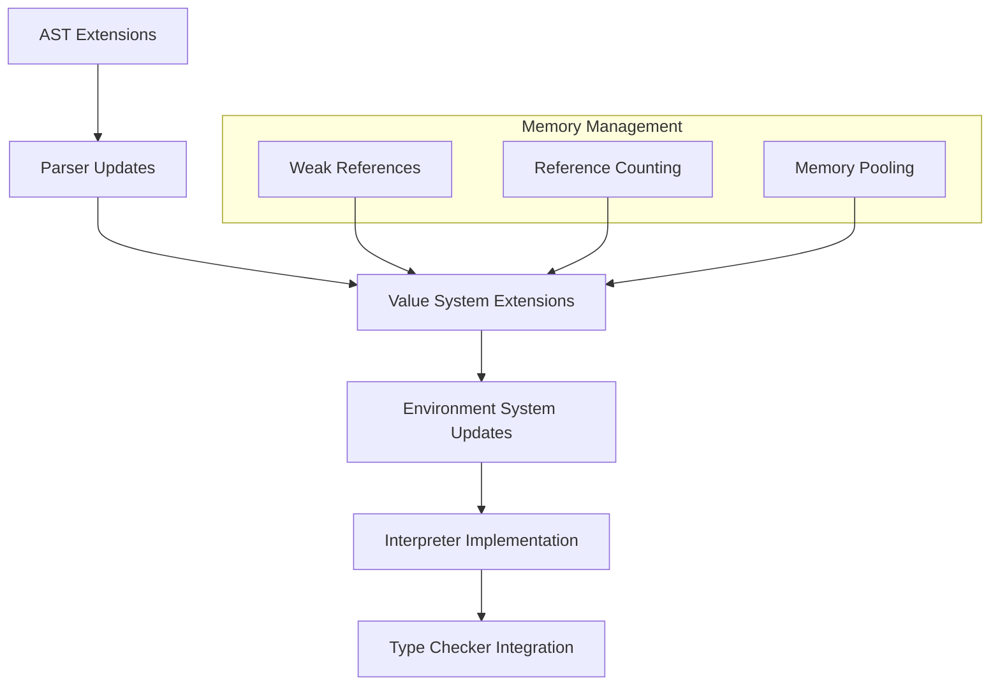
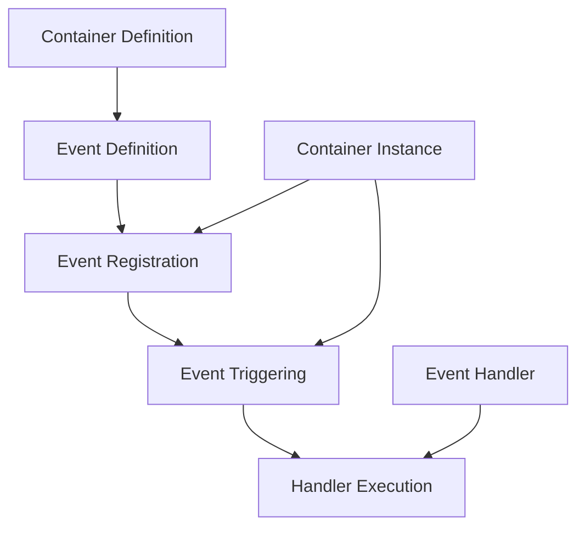

# Container Implementation Plan for WFL

## 1. Overview

Based on the documentation in `wfl-containers.md` and `wfl-actions.md`, we need to implement a complete container system that allows users to define custom data types with properties and behaviors. The implementation must:

- Support all features described in the documentation
- Minimize memory allocations
- Avoid reference cycles
- Maintain backward compatibility
- Follow WFL's natural language approach

## 2. Architecture Design



## 3. Detailed Implementation Plan

### 3.1 AST Extensions

We need to extend the AST structure in `src/parser/ast.rs` to support container-related constructs:

```rust
// Add to Statement enum
ContainerDefinition {
    name: String,
    extends: Option<String>,
    implements: Vec<String>,
    properties: Vec<PropertyDefinition>,
    methods: Vec<Statement>, // ActionDefinition statements
    events: Vec<EventDefinition>,
    static_properties: Vec<PropertyDefinition>,
    static_methods: Vec<Statement>,
    line: usize,
    column: usize,
},

ContainerInstantiation {
    container_type: String,
    instance_name: String,
    arguments: Vec<Argument>,
    property_initializers: Vec<PropertyInitializer>,
    line: usize,
    column: usize,
},

InterfaceDefinition {
    name: String,
    required_actions: Vec<ActionSignature>,
    line: usize,
    column: usize,
},

EventDefinition {
    name: String,
    parameters: Vec<Parameter>,
    line: usize,
    column: usize,
},

EventTrigger {
    name: String,
    arguments: Vec<Argument>,
    line: usize,
    column: usize,
},

EventHandler {
    event_source: Expression,
    event_name: String,
    handler_body: Vec<Statement>,
    line: usize,
    column: usize,
},
```

Supporting structures:

```rust
pub struct PropertyDefinition {
    pub name: String,
    pub property_type: Option<Type>,
    pub default_value: Option<Expression>,
    pub validation_rules: Vec<ValidationRule>,
    pub visibility: Visibility,
    pub is_static: bool,
    pub line: usize,
    pub column: usize,
}

pub struct ValidationRule {
    pub rule_type: ValidationRuleType,
    pub parameters: Vec<Expression>,
    pub line: usize,
    pub column: usize,
}

pub enum ValidationRuleType {
    NotEmpty,
    MinLength,
    MaxLength,
    ExactLength,
    MinValue,
    MaxValue,
    Pattern,
    Custom,
}

pub enum Visibility {
    Public,
    Private,
}

pub struct PropertyInitializer {
    pub name: String,
    pub value: Expression,
    pub line: usize,
    pub column: usize,
}

pub struct ActionSignature {
    pub name: String,
    pub parameters: Vec<Parameter>,
    pub return_type: Option<Type>,
}
```

### 3.2 Value System Extensions

Extend the value system in `src/interpreter/value.rs` to support container-related values:

```rust
// Add to Value enum
Container(Rc<ContainerValue>),
ContainerInstance(Rc<RefCell<ContainerInstanceValue>>),
Interface(Rc<InterfaceValue>),
Event(Rc<EventValue>),
```

Supporting structures with memory optimization:

```rust
pub struct ContainerValue {
    pub name: String,
    pub extends: Option<Weak<ContainerValue>>, // Weak reference to avoid cycles
    pub implements: Vec<Weak<InterfaceValue>>, // Weak references to avoid cycles
    pub properties: HashMap<String, PropertyDefinition>,
    pub methods: HashMap<String, Rc<FunctionValue>>,
    pub static_properties: HashMap<String, Value>,
    pub static_methods: HashMap<String, Rc<FunctionValue>>,
    pub events: HashMap<String, Rc<EventValue>>,
    // Cache for inherited properties and methods to avoid repeated lookups
    pub property_cache: RefCell<HashMap<String, (Weak<ContainerValue>, PropertyDefinition)>>,
    pub method_cache: RefCell<HashMap<String, (Weak<ContainerValue>, Rc<FunctionValue>)>>,
}

pub struct ContainerInstanceValue {
    pub container: Weak<ContainerValue>, // Weak reference to avoid cycles
    pub properties: HashMap<String, Value>,
    pub env: Weak<RefCell<Environment>>, // Weak reference to avoid cycles
    pub event_handlers: HashMap<String, Vec<Rc<FunctionValue>>>,
}

pub struct InterfaceValue {
    pub name: String,
    pub required_actions: HashMap<String, ActionSignature>,
}

pub struct EventValue {
    pub name: String,
    pub parameters: Vec<String>,
}
```

## 4. Event System Implementation

The event system is a critical part of the container implementation, enabling reactive programming patterns. This section provides a detailed explanation of how events, triggers, and handlers will be implemented.

### 4.1 Event System Architecture



### 4.2 Event Definition

Events are defined within container definitions using the `event` keyword:

```wfl
create container Button:
    property label as text
    
    // Event definitions
    event clicked
    event hover start with x and y
    event hover end
end container
```

In the AST, events are represented as `EventDefinition` structures:

```rust
pub struct EventDefinition {
    pub name: String,
    pub parameters: Vec<Parameter>,
    pub line: usize,
    pub column: usize,
}
```

During parsing, the `parse_event_definition` function will extract the event name and any parameters:

```rust
fn parse_event_definition(&mut self) -> Result<EventDefinition, ParseError> {
    self.expect_token(Token::KeywordEvent, "Expected 'event'")?;
    
    let name = self.parse_identifier()?;
    
    let mut parameters = Vec::new();
    
    // Check if there are parameters (with keyword)
    if self.match_token(Token::KeywordWith) {
        parameters = self.parse_parameter_list()?;
    }
    
    Ok(EventDefinition {
        name,
        parameters,
        line: /* current line */,
        column: /* current column */,
    })
}
```

### 4.3 Event Storage

Events are stored in the `ContainerValue` structure:

```rust
pub struct ContainerValue {
    // Other fields...
    pub events: HashMap<String, Rc<EventValue>>,
}

pub struct EventValue {
    pub name: String,
    pub parameters: Vec<String>,
}
```

When a container is defined, its events are registered in this map:

```rust
async fn execute_container_definition(&self, /* params */) -> Result<Value, RuntimeError> {
    // Create container value
    let container = Rc::new(ContainerValue {
        // Other fields...
        events: HashMap::new(),
    });
    
    // Register events
    for event_def in events {
        let event_value = Rc::new(EventValue {
            name: event_def.name.clone(),
            parameters: event_def.parameters.iter().map(|p| p.name.clone()).collect(),
        });
        
        container.events.insert(event_def.name.clone(), event_value);
    }
    
    // Register container in environment
    env.borrow_mut().define(&name, Value::Container(container));
    
    Ok(Value::Null)
}
```

### 4.4 Event Handlers

Event handlers are defined using the `on` keyword followed by an event source, event name, and handler body:

```wfl
create new Button as submit_button:
    set label to "Submit"
end create

// Event handler registration
on submit_button clicked:
    display "Button was clicked!"
end on
```

In the AST, event handlers are represented as `EventHandler` structures:

```rust
pub struct EventHandler {
    pub event_source: Expression,
    pub event_name: String,
    pub handler_body: Vec<Statement>,
    pub line: usize,
    pub column: usize,
}
```

The parser will extract the event source, event name, and handler body:

```rust
fn parse_event_handler(&mut self) -> Result<Statement, ParseError> {
    self.expect_token(Token::KeywordOn, "Expected 'on'")?;
    
    let event_source = self.parse_expression()?;
    let event_name = self.parse_identifier()?;
    
    self.expect_token(Token::Colon, "Expected ':' after event name")?;
    
    let handler_body = self.parse_block()?;
    
    self.expect_token(Token::KeywordEnd, "Expected 'end'")?;
    self.expect_token(Token::KeywordOn, "Expected 'on' after 'end'")?;
    
    Ok(Statement::EventHandler {
        event_source,
        event_name,
        handler_body,
        line: /* current line */,
        column: /* current column */,
    })
}
```

### 4.5 Event Handler Registration

Event handlers are stored in the `ContainerInstanceValue` structure:

```rust
pub struct ContainerInstanceValue {
    // Other fields...
    pub event_handlers: HashMap<String, Vec<Rc<FunctionValue>>>,
}
```

When an event handler is defined, it's registered with the container instance:

```rust
async fn execute_event_handler(
    &self,
    event_source: &Expression,
    event_name: &str,
    handler_body: &[Statement],
    env: Rc<RefCell<Environment>>,
) -> Result<Value, RuntimeError> {
    // Evaluate event source to get container instance
    let source_value = self.evaluate_expression(event_source, Rc::clone(&env)).await?;
    
    match source_value {
        Value::ContainerInstance(instance) => {
            let mut instance_ref = instance.borrow_mut();
            
            // Check if the event exists on the container
            let container = match instance_ref.container.upgrade() {
                Some(c) => c,
                None => return Err(RuntimeError::new(
                    "Container no longer exists".to_string(),
                    /* line */,
                    /* column */,
                )),
            };
            
            if !container.events.contains_key(event_name) {
                return Err(RuntimeError::new(
                    format!("Event '{}' not found on container", event_name),
                    /* line */,
                    /* column */,
                ));
            }
            
            // Create function value for handler
            let handler = Rc::new(FunctionValue {
                name: Some(format!("{}_{}_handler", instance_ref.container.name, event_name)),
                params: vec![],  // Event parameters will be passed when triggered
                body: handler_body.to_vec(),
                env: Rc::downgrade(&env),
                line: /* line */,
                column: /* column */,
            });
            
            // Register handler
            instance_ref.event_handlers
                .entry(event_name.to_string())
                .or_insert_with(Vec::new)
                .push(handler);
            
            Ok(Value::Null)
        },
        _ => Err(RuntimeError::new(
            "Event source must be a container instance".to_string(),
            /* line */,
            /* column */,
        )),
    }
}
```

### 4.6 Event Triggering

Events are triggered using the `trigger` keyword:

```wfl
define action click:
    if is_enabled:
        trigger clicked  // Trigger event with no parameters
        display "Button was clicked"
    end if
end action

define action hover at with x_pos and y_pos:
    trigger hover start with x_pos and y_pos  // Trigger event with parameters
    display "Hovering at " with x_pos with "," with y_pos
end action
```

In the AST, event triggers are represented as `EventTrigger` structures:

```rust
pub struct EventTrigger {
    pub name: String,
    pub arguments: Vec<Argument>,
    pub line: usize,
    pub column: usize,
}
```

The parser will extract the event name and any arguments:

```rust
fn parse_event_trigger(&mut self) -> Result<Statement, ParseError> {
    self.expect_token(Token::KeywordTrigger, "Expected 'trigger'")?;
    
    let name = self.parse_identifier()?;
    
    let mut arguments = Vec::new();
    
    // Check if there are arguments (with keyword)
    if self.match_token(Token::KeywordWith) {
        arguments = self.parse_argument_list()?;
    }
    
    Ok(Statement::EventTrigger {
        name,
        arguments,
        line: /* current line */,
        column: /* current column */,
    })
}
```

### 4.7 Event Handler Execution

When an event is triggered, all registered handlers for that event are executed:

```rust
async fn execute_event_trigger(
    &self,
    name: &str,
    arguments: &[Argument],
    env: Rc<RefCell<Environment>>,
) -> Result<Value, RuntimeError> {
    // Get the current container instance from the environment
    let this_value = match env.borrow().get("this") {
        Some(Value::ContainerInstance(instance)) => Value::ContainerInstance(instance),
        _ => return Err(RuntimeError::new(
            "Cannot trigger event outside of container method".to_string(),
            /* line */,
            /* column */,
        )),
    };
    
    match this_value {
        Value::ContainerInstance(instance) => {
            let instance_ref = instance.borrow();
            
            // Check if the event exists on the container
            let container = match instance_ref.container.upgrade() {
                Some(c) => c,
                None => return Err(RuntimeError::new(
                    "Container no longer exists".to_string(),
                    /* line */,
                    /* column */,
                )),
            };
            
            if !container.events.contains_key(name) {
                return Err(RuntimeError::new(
                    format!("Event '{}' not found on container", name),
                    /* line */,
                    /* column */,
                ));
            }
            
            // Evaluate arguments
            let mut arg_values = Vec::new();
            for arg in arguments {
                let value = self.evaluate_expression(&arg.value, Rc::clone(&env)).await?;
                arg_values.push(value);
            }
            
            // Get handlers for this event
            if let Some(handlers) = instance_ref.event_handlers.get(name) {
                // Execute each handler
                for handler in handlers {
                    // Create a new environment for the handler
                    let handler_env = Environment::new(&env);
                    
                    // Add arguments to environment
                    let event_params = &container.events.get(name).unwrap().parameters;
                    for (i, param) in event_params.iter().enumerate() {
                        if i < arg_values.len() {
                            handler_env.borrow_mut().define(param, arg_values[i].clone());
                        } else {
                            handler_env.borrow_mut().define(param, Value::Null);
                        }
                    }
                    
                    // Execute handler
                    self.execute_block(&handler.body, Rc::clone(&handler_env)).await?;
                }
            }
            
            Ok(Value::Null)
        },
        _ => Err(RuntimeError::new(
            "Cannot trigger event outside of container method".to_string(),
            /* line */,
            /* column */,
        )),
    }
}
```

### 4.8 Event Inheritance

Events are inherited from parent containers:

```wfl
create container UIElement:
    event clicked
    event focus
    event blur
end container

create container Button extends UIElement:
    event hover  // Adds a new event
    // Inherits clicked, focus, and blur events
end container
```

When resolving events, the interpreter checks the container and all its ancestors:

```rust
fn resolve_event(&self, container: &ContainerValue, name: &str) -> Option<Rc<EventValue>> {
    // Check own events
    if let Some(event) = container.events.get(name) {
        return Some(event.clone());
    }
    
    // Check parent container
    if let Some(parent_weak) = &container.extends {
        if let Some(parent) = parent_weak.upgrade() {
            return self.resolve_event(&parent, name);
        }
    }
    
    None
}
```

### 4.9 Memory Management for Events

To avoid memory leaks and reference cycles, we'll use several strategies:

1. **Weak References for Container References**:
   ```rust
   pub struct ContainerInstanceValue {
       pub container: Weak<ContainerValue>, // Weak reference to avoid cycles
       // Other fields...
   }
   ```

2. **Handler Cleanup**:
   When a container instance is dropped, its event handlers should be cleaned up:
   ```rust
   impl Drop for ContainerInstanceValue {
       fn drop(&mut self) {
           // Clear event handlers to break potential reference cycles
           self.event_handlers.clear();
       }
   }
   ```

3. **Event Handler Pool**:
   For frequently triggered events, we can use an object pool for handler execution contexts:
   ```rust
   pub struct EventHandlerContext {
       pub arguments: HashMap<String, Value>,
       pub result: Option<Value>,
   }
   
   pub struct EventHandlerPool {
       pub available: Vec<EventHandlerContext>,
       pub capacity: usize,
   }
   ```

### 4.10 Event System Error Handling

Specific error types for the event system:

```rust
// Add to ErrorKind enum
EventNotFound,
EventHandlerError,
InvalidEventArguments,
```

Error messages:
- "Event '{0}' not found on container '{1}'"
- "Error in event handler: {0}"
- "Invalid arguments for event '{0}': expected {1}, got {2}"

## 5. Implementation Phases

### 5.1 Phase 1: Basic Container Support
- AST extensions for container definitions and instantiation
- Parser updates for basic container syntax
- Value system extensions for containers
- Basic interpreter support for containers

### 5.2 Phase 2: Properties and Methods
- Property definitions with validation
- Method definitions and calls
- Container instantiation
- Memory optimization foundations

### 5.3 Phase 3: Inheritance and Interfaces
- Container inheritance
- Interface definitions and implementation
- Composition (containers as properties)
- Static members

### 5.4 Phase 4: Event System
- Event definitions
- Event triggers
- Event handlers
- Event inheritance
- Memory optimizations for events

### 5.5 Phase 5: Integration and Testing
- Type checker integration
- Error handling improvements
- Documentation updates
- Comprehensive testing

## 6. Testing Strategy

### 6.1 Unit Tests

1. **Event System Tests**:
   - Test event definition parsing
   - Test event handler registration
   - Test event triggering
   - Test event inheritance
   - Test event parameters

2. **Memory Tests**:
   - Test for memory leaks in event handlers
   - Test for reference cycles in event system
   - Test memory usage with many event handlers

### 6.2 Integration Tests

1. **Feature Tests**:
   - Test events working with inheritance
   - Test complex event chains
   - Test event handlers accessing container state

2. **Error Handling Tests**:
   - Test triggering undefined events
   - Test invalid event arguments
   - Test event handler errors

## 7. Conclusion

This implementation plan provides a comprehensive approach to adding container functionality to WFL, with special focus on the event system. By following this plan, we can ensure that the implementation is robust, memory-efficient, and aligns with WFL's natural language approach to programming.