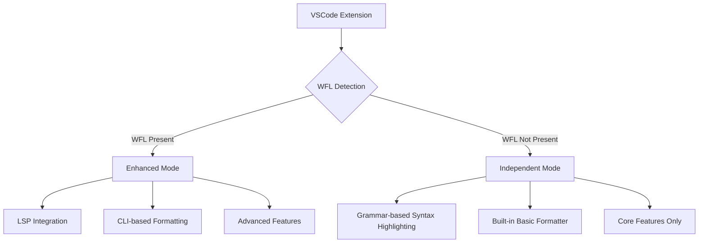

# WFL VSCode Extension Design Document

## Introduction

This document outlines the design for a consolidated VSCode extension for the WebFirst Language (WFL) that provides syntax highlighting and auto-formatting capabilities. The extension is designed to operate both with and without WFL installed, providing independent functionality when WFL tools are not available.

## Background

Currently, there are two separate VSCode extension implementations for WFL:
1. A simpler JavaScript-based implementation in `editors/vscode-wfl`
2. A more advanced TypeScript-based implementation in `vscode-extension`

This design aims to consolidate these implementations and enhance them with robust syntax highlighting and formatting capabilities that can operate independently of the WFL toolchain.

## Design Goals

1. **Extension Consolidation**: Merge the existing implementations into a single, maintainable codebase
2. **Independent Operation**: Provide core functionality without requiring WFL to be installed
3. **Enhanced Integration**: Leverage WFL tools when available for advanced functionality
4. **Comprehensive Syntax Highlighting**: Create a detailed TextMate grammar for WFL
5. **Flexible Formatting**: Support multiple formatting approaches

## Architecture Overview



## Implementation Strategy

### 1. Extension Consolidation

We will use the TypeScript implementation (`vscode-extension`) as our base due to its:
- Type safety and maintainability
- More structured and extensible codebase
- Comprehensive configuration options
- Proper build system

### 2. Independent Operation

Core features that will work without WFL installed:

#### 2.1 Self-contained TextMate Grammar
- Comprehensive grammar not requiring semantic tokens
- Complete keyword, operator, and structure highlighting
- Proper scoping for all WFL language constructs

#### 2.2 Built-in JavaScript-based Formatter
- Simple formatter implemented directly in the extension
- Basic indentation and alignment rules
- No dependency on external WFL tooling

#### 2.3 Adaptive Configuration
- Detect availability of WFL tools at runtime
- Enable/disable features based on availability
- Clear user feedback on available functionality

### 3. Enhanced Integration (When WFL is Available)

#### 3.1 Full LSP Integration
- Diagnostics, hover information, completion
- Go-to definition, find references
- Advanced semantic highlighting

#### 3.2 WFL CLI-based Advanced Formatting
- Integration with the WFL linter and fixer
- Full formatting capabilities
- Advanced configuration options

## Syntax Highlighting Design

The enhanced TextMate grammar will include:

### Token Categories
- **Keywords**: Control flow, declarations, operators
  - `define`, `action`, `store`, `display`, `if`, `check`, `otherwise`, etc.
- **Operators**: Arithmetic, comparison, logical
  - `+`, `-`, `*`, `/`, `is`, `not`, `and`, `or`, etc.
- **Literals**: Strings, numbers, booleans
  - String literals with proper escape handling
  - Numeric literals (integers and decimals)
  - Boolean literals (`yes`, `no`)
- **Functions/Actions**: Definitions and calls
  - Action definitions (`define action called...`)
  - Action calls
  - Function parameters
- **Variables**: Declarations and references
  - Variable declarations (`store ... as ...`)
  - Variable references
- **Special WFL Constructs**:
  - File operations (`open file`, `close file`, etc.)
  - Asynchronous operations (`wait for`, etc.)
  - Error handling (`try`, `when`, etc.)

### Scoping Rules
- Block structures (`if`/`end if`, `action`/`end action`, etc.)
- Proper handling of indentation-based syntax
- Multi-line constructs

## Auto-Formatting Design

### Independent Formatter Features
- Indentation management (4 spaces by default)
- Alignment of related statements
- Correct spacing around operators and keywords
- Basic block structure formatting

### WFL-Based Formatter Integration
- Integration with `wfl --lint --fix`
- Support for configuration options:
  - Indent size
  - Maximum line length
  - Format on save
  - Format on type

## Configuration Options

```json
"wfl.format": {
  "enable": true,
  "indentSize": 4,
  "maxLineLength": 80,
  "formatOnSave": true,
  "formatOnType": false,
  "provider": "auto"  // "auto", "builtin", or "wfl"
},
"wfl.lsp": {
  "enable": true,
  "serverPath": "wfl-lsp",
  "serverArgs": [],
  "versionMode": "warn"
},
"wfl.cli": {
  "path": "wfl",
  "autoDetect": true
}
```

## Extension File Structure

```
vscode-wfl/
├── package.json          # Extension manifest with all configurations
├── tsconfig.json         # TypeScript configuration
├── .vscodeignore         # Packaging exclusion rules
├── README.md             # User documentation
├── CHANGELOG.md          # Version history
├── syntaxes/
│   └── wfl.tmLanguage.json  # Enhanced TextMate grammar
├── language-configuration.json  # Language configuration
├── src/
│   ├── extension.ts      # Main extension entry point
│   ├── wfl-detection.ts  # WFL tool detection logic
│   ├── formatting/
│   │   ├── base-formatter.ts     # Independent formatter
│   │   └── wfl-formatter.ts      # WFL CLI integration
│   ├── lsp/
│   │   └── client.ts     # LSP client implementation
│   └── utils/
│       └── config.ts     # Configuration utilities
└── test/
    └── extension.test.ts  # Extension tests
```

## Implementation Plan

### Phase 1: Extension Consolidation
1. Set up TypeScript project structure
2. Port or merge any unique features from JavaScript version
3. Enhance TextMate grammar for basic syntax highlighting

### Phase 2: Independent Functionality
1. Implement WFL detection logic
2. Develop basic formatter in JavaScript/TypeScript
3. Add configuration options for independent mode

### Phase 3: Enhanced Integration
1. Enhance LSP client with graceful fallbacks
2. Implement WFL CLI formatting integration
3. Create comprehensive documentation

## Technical Challenges

1. **Independent Formatter Limitations**:
   - The independent formatter won't match the full capabilities of WFL's native formatter
   - Focus on common, predictable formatting patterns
   - Clear communication of limitations to users

2. **Grammar-only Syntax Highlighting Challenges**:
   - TextMate grammar can't perform semantic analysis
   - Some advanced highlighting may only work with LSP
   - Need to design grammar to handle common patterns effectively

3. **Configuration Synchronization**:
   - Keeping formatting options consistent between independent and WFL-based formatters
   - Providing clear UI indicators for active formatter

4. **Graceful Feature Degradation**:
   - Designing each feature to fall back gracefully
   - Providing helpful messages when enhanced features are unavailable

## Conclusion

This design provides a pathway to a consolidated and enhanced VSCode extension for WFL that works both with and without the WFL toolchain installed. The proposed architecture allows for independent operation while leveraging WFL tools when available, ensuring a consistent and robust development experience for WFL users.